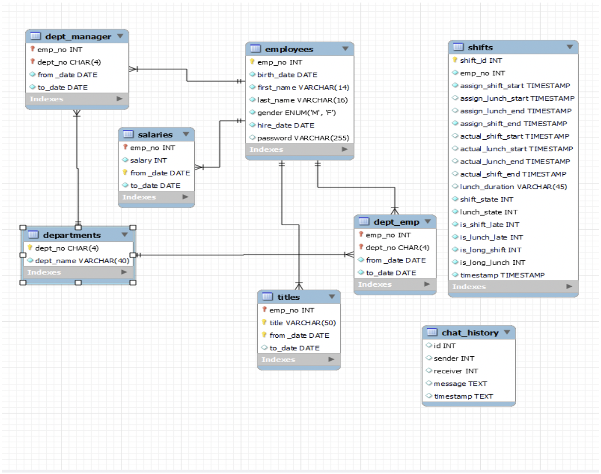

# MyHR - Enterprise HR Management System

<div align="center">


**A comprehensive enterprise HR web application for employee management, time tracking, and workplace communication**

[](https://www.python.org/downloads/)
[](https://reactjs.org/)
[](https://flask.palletsprojects.com/)
[](https://www.mysql.com/)
[](https://jenkins.io/)

[Live Demo](#) • [Documentation](#) • [Report](readme/)

</div>

---

## 📋 Table of Contents

- [Overview](#overview)
- [Features](#features)
- [Tech Stack](#tech-stack)
- [Architecture](#architecture)
- [Installation](#installation)
- [API Documentation](#api-documentation)
- [Deployment](#deployment)
- [Contributing](#contributing)
- [Team](#team)
- [License](#license)

## 🎯 Overview

MyHR is a modern enterprise HR web application designed to streamline employee management processes. Built with a Model-View-Controller architecture, it provides comprehensive solutions for time tracking, schedule management, employee communication, and administrative tasks.

The system addresses common workplace challenges such as manual time tracking errors, communication barriers, and inefficient HR processes by offering automated, secure, and user-friendly solutions.

## ✨ Features

### 🔐 Authentication & Security

- **JWT Token-based Authentication** - Secure user sessions
- **Role-based Access Control** - Employee, Manager, and Admin roles
- **Google SSO Integration** - Third-party authentication support
- **SSL/TLS Encryption** - Secure data transmission

### ⏰ Time Management

- **Digital Clock System** - Real-time time display
- **Smart Clock-in/out** - Automated time tracking with validation
- **Lunch Break Management** - Track lunch start/end times
- **Shift Violation Detection** - Early/late clock-in notifications

### 📅 Schedule Management

- **Employee Shift Viewing** - Personal schedule access
- **Manager Shift Assignment** - Department-wide scheduling
- **Shift CRUD Operations** - Add, remove, and modify shifts
- **Department-based Access** - Manager controls within their department

### 💬 Communication

- **Real-time Messaging** - WebSocket-based chat system
- **Employee Search** - Find colleagues by name or ID
- **Recent Chat History** - Quick access to conversations
- **Profile-based Messaging** - User-friendly chat interface

### 👥 Employee Management

- **Dashboard Analytics** - Salary history visualization
- **Profile Management** - Update pictures, mottos, and passwords
- **Department Information** - Current role and department details
- **Admin User Table** - Full CRUD operations for administrators

### 📊 Administrative Tools

- **User Management System** - Complete employee record management
- **Database Operations** - Add, edit, and delete user records
- **Role Management** - Assign and modify user permissions
- **System Monitoring** - Track application performance

## 🎥 Demo Video

Watch the full demo here:  
[](https://drive.google.com/file/d/1Gn4eLuizfnoXp_rcFbmTvubV_LXHV1un/view?usp=drive_link)

## 🛠️ Tech Stack

### Backend

- **Framework**: Flask 3.0.0
- **Database**: MySQL 8.0+ with Amazon RDS
- **Authentication**: JWT (PyJWT 2.8.0)
- **Real-time Communication**: Flask-SocketIO 5.3.6
- **Caching**: Redis 5.0.1
- **CORS**: Flask-CORS 4.0.0
- **Environment**: Python 3.8+

### Frontend

- **Framework**: React 18.2.0
- **State Management**: Redux Toolkit 1.9.7
- **Routing**: React Router DOM 6.16.0
- **Styling**: Tailwind CSS 3.3.3, Material-UI 5.14.19
- **Charts**: ApexCharts 3.44.0
- **Forms**: Formik 2.4.5, React Hook Form 7.48.2
- **Real-time**: Socket.io Client 4.7.2
- **HTTP Client**: Axios 1.6.2

### DevOps & Infrastructure

- **CI/CD**: Jenkins
- **Cloud Hosting**: Linode
- **Database Hosting**: Amazon RDS
- **Version Control**: Git & GitHub
- **Containerization**: Docker (optional)

## 🏗️ Architecture

### System Design

```
┌─────────────────┐    ┌─────────────────┐    ┌─────────────────┐
│   Frontend     │    │    Backend      │    │    Database     │
│   (React)      │◄──►│    (Flask)      │◄──►│    (MySQL)      │
└─────────────────┘    └─────────────────┘    └─────────────────┘
         │                       │                       │
         │              ┌─────────────────┐              │
         │              │     Redis       │              │
         │              │   (Caching)     │              │
         │              └─────────────────┘              │
         │                                              │
         └──────────────┐    ┌─────────────────┐        │
                        │    │   WebSocket     │        │
                        └───►│  (Socket.io)    │◄───────┘
                             └─────────────────┘
```

### Database Schema

The system extends the standard enterprise database with additional tables:

- **shifts** - Employee shift scheduling
- **chat_history** - Message storage
- **employees** - Core employee data
- **departments** - Organizational structure
- **titles** - Job positions
- **salaries** - Compensation history

## 🗄️ Entity-Relationship Diagram

  
*Database schema showing relationships between users, devices, and anomalies.*

## 🚀 Installation

### Prerequisites

- Python 3.8+
- Node.js 16+
- MySQL 8.0+
- Redis 6.0+

### Backend Setup

1. **Clone the repository**

   ```bash
   git clone https://github.com/your-username/MyHR.git
   cd MyHR/backend
   ```

2. **Create virtual environment**

   ```bash
   python -m venv venv
   source venv/bin/activate  # On Windows: venv\Scripts\activate
   ```

3. **Install dependencies**

   ```bash
   pip install -r requirements.txt
   ```

4. **Configure environment**

   ```bash
   cp .env.example .env
   # Edit .env with your database credentials
   ```

5. **Run the application**
   ```bash
   python app.py
   ```

### Frontend Setup

1. **Navigate to frontend directory**

   ```bash
   cd ../frontend
   ```

2. **Install dependencies**

   ```bash
   npm install
   ```

3. **Start development server**
   ```bash
   npm start
   ```

## 📚 API Documentation

### Authentication Endpoints

| Method | Endpoint       | Description | Request Body              | Response              |
| ------ | -------------- | ----------- | ------------------------- | --------------------- |
| `POST` | `/auth/login`  | User login  | `{employee_no, password}` | JWT token + user data |
| `POST` | `/auth/logout` | User logout | -                         | Success message       |

### Dashboard Endpoints

| Method | Endpoint     | Description             | Request Body | Response                  |
| ------ | ------------ | ----------------------- | ------------ | ------------------------- |
| `GET`  | `/dashboard` | Get user dashboard data | -            | Salary history, dept info |

### Time Tracking Endpoints

| Method | Endpoint           | Description         | Request Body   | Response              |
| ------ | ------------------ | ------------------- | -------------- | --------------------- |
| `POST` | `/dashboard/clock` | Clock in/out action | `{type, time}` | Success/error message |

### Messaging Endpoints

| Method | Endpoint           | Description      | Request Body             | Response        |
| ------ | ------------------ | ---------------- | ------------------------ | --------------- |
| `GET`  | `/message/users`   | Get all users    | -                        | User list       |
| `POST` | `/message/send`    | Send message     | `{receiver_id, content}` | Success message |
| `GET`  | `/message/history` | Get chat history | `{user_id}`              | Message history |

### Schedule Management Endpoints

| Method   | Endpoint           | Description            | Request Body           | Response        |
| -------- | ------------------ | ---------------------- | ---------------------- | --------------- |
| `GET`    | `/schedule/shifts` | Get user shifts        | -                      | Shift list      |
| `POST`   | `/schedule/assign` | Assign shift (Manager) | `{emp_id, start, end}` | Success message |
| `DELETE` | `/schedule/remove` | Remove shift (Manager) | `{shift_id}`           | Success message |

### Admin Endpoints

| Method   | Endpoint           | Description   | Request Body | Response        |
| -------- | ------------------ | ------------- | ------------ | --------------- |
| `GET`    | `/admin/users`     | Get all users | -            | User table data |
| `POST`   | `/admin/users`     | Add new user  | User data    | Success message |
| `PUT`    | `/admin/users/:id` | Update user   | User data    | Success message |
| `DELETE` | `/admin/users/:id` | Delete user   | -            | Success message |

### Settings Endpoints

| Method | Endpoint             | Description     | Request Body     | Response        |
| ------ | -------------------- | --------------- | ---------------- | --------------- |
| `PUT`  | `/settings/password` | Change password | `{current, new}` | Success message |
| `PUT`  | `/settings/profile`  | Update profile  | Profile data     | Success message |

## 🚀 Deployment

### Production Deployment

The application is deployed on Linode servers with the following configuration:

- **Frontend**: Static hosting with React build
- **Backend**: Flask application with Gunicorn
- **Database**: Amazon RDS MySQL instance
- **Caching**: Redis for session management
- **CI/CD**: Jenkins pipeline for automated deployment

### Deployment Commands

```bash
# Frontend build
npm run build

# Backend deployment
gunicorn -w 4 -b 0.0.0.0:5000 app:app

# Database migration
flask db upgrade
```

## 👥 Team

**Team Alpha** - CMPE-272 Fall 2023

| Role             | Name       | Responsibilities                        |
| ---------------- | ---------- | --------------------------------------- |
| **Project Lead** | Jiajun Dai | Project management, backend development |
| **Developer**    | Yifu Fang  | Frontend development, UI/UX             |
| **Developer**    | Walton Ma  | Database design, API development        |
| **Developer**    | Sarah Yu   | Testing, documentation                  |

## 📄 License

This project is licensed under the MIT License - see the [LICENSE](LICENSE) file for details.

---

<div align="center">

**Built with ❤️ by Team Alpha**

[](https://github.com/your-username/MyHR)
[](https://linkedin.com/in/your-profile)

</div>
