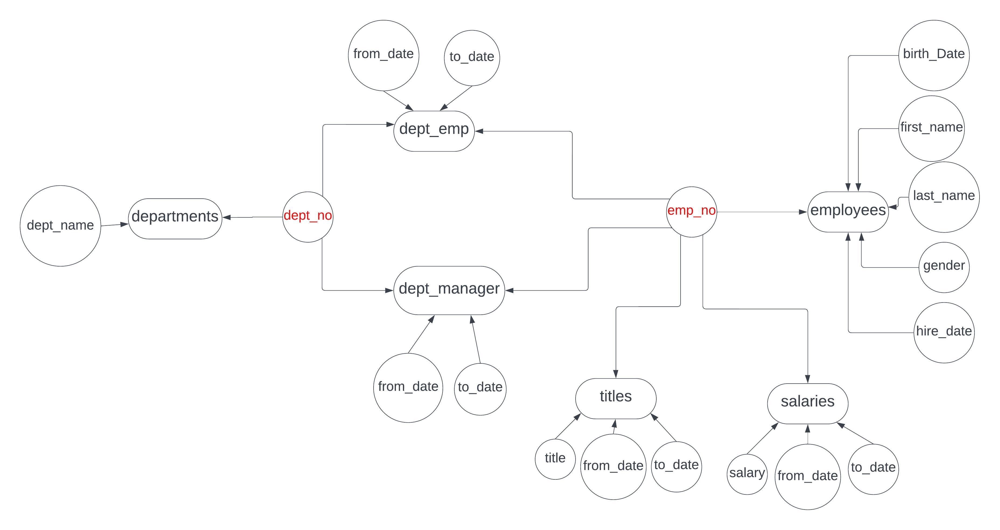

# CMPE272_Project
Your team works for a company that wants to create an enterprise HR Portal application.
Your manager has provided a backup of the company’s enterprise database
and asks that you use it to demonstrate a Proof of Concept application 
- company's enterprise database link: [https://github.com/datacharmer/test_db](https://github.com/datacharmer/test_db)

## including:
- Single Sign on (SSO) / AD authentication with SSL/TLS encryption
- Application / Web portal for viewing/browsing (sample) enterprise employee data (with SSO roles)
- Github (or other repo) integrated into SSO (optional)
- Jenkins, integrated into SSO and Github repo;
- Additional integrations / features / capabilities for higher grade (layered security, social media integration, document repository, Salesforce integration, etc..)
## Project Deliverables:
- Project Plan in .docx format. There’s a template in Canvas, or you can make your own
- Project Presentation in .pptx format
- Project Report: .docx format, including design patterns, diagrams, use/test cases, screenshots, etc. There is a template in Canvas
- 15 minute live project presentation, where each team member MUST present/speak for a portion
- Code (checked into github , with references in Project Report: [https://github.com/sjsu-cmpe272](https://github.com/sjsu-cmpe272)
## Sample project provided by prof: [https://github.com/sjsu-cmpe282/the-elite](https://github.com/sjsu-cmpe282/the-elite)
